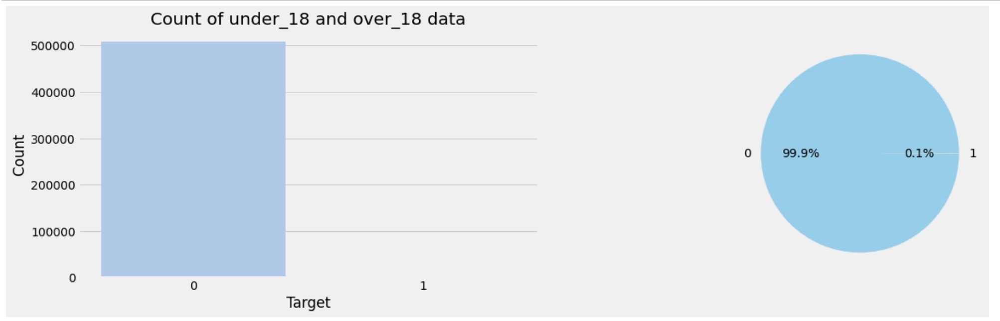
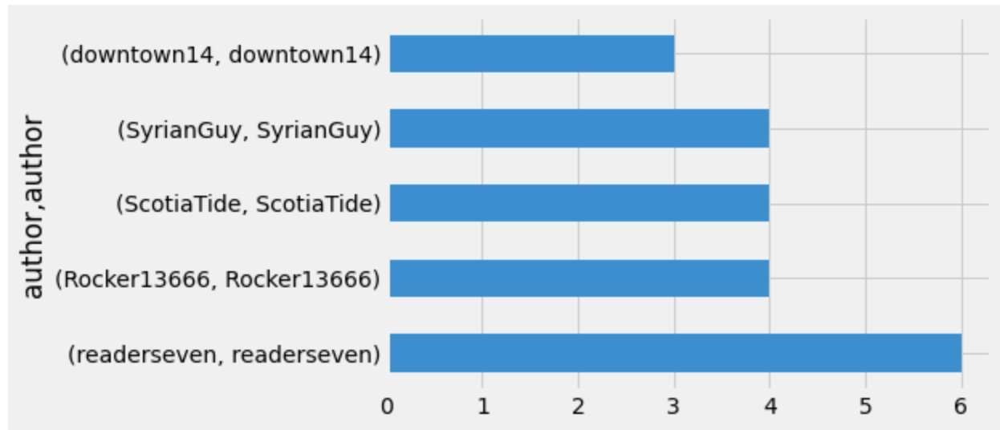
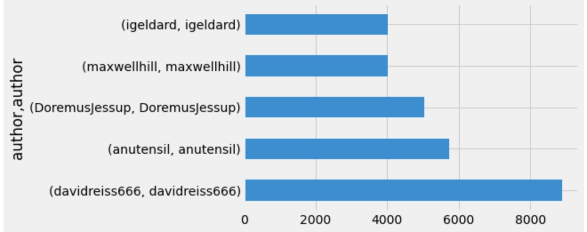
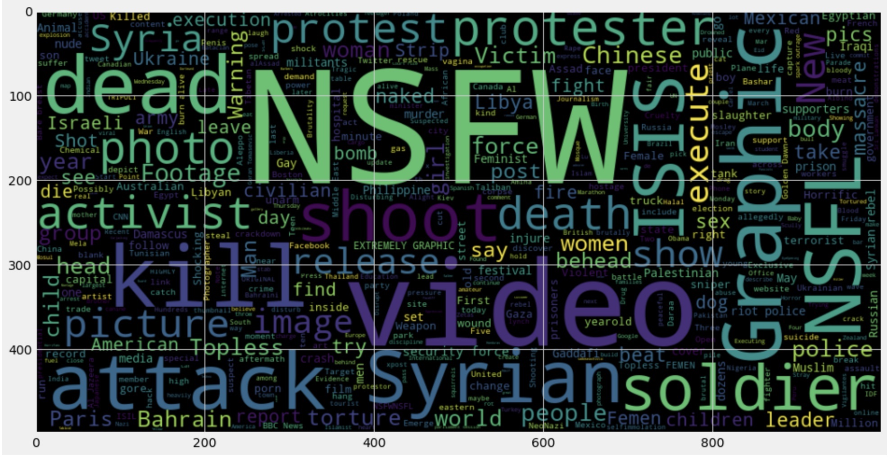
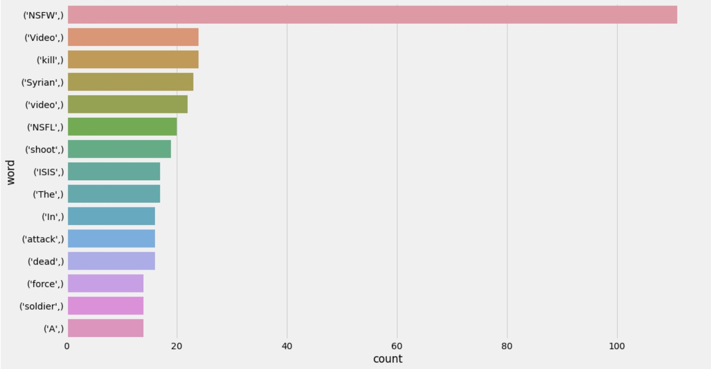
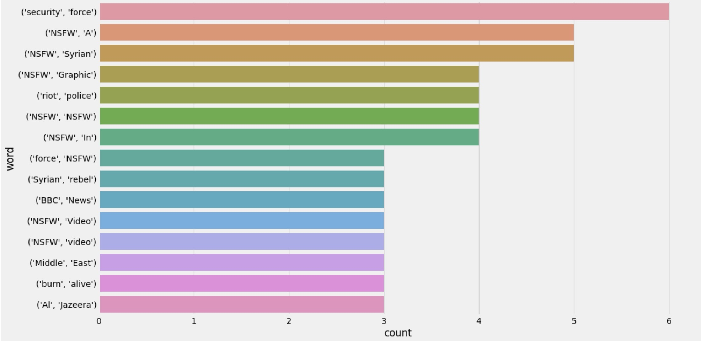
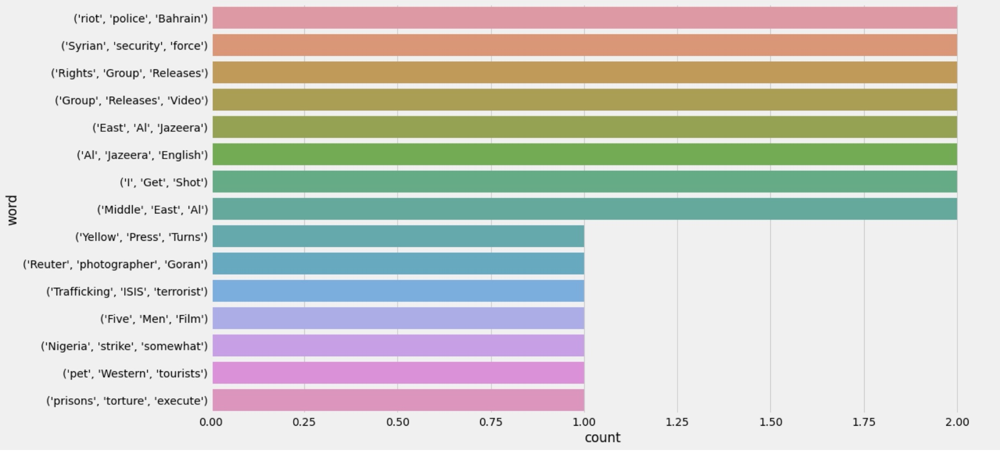
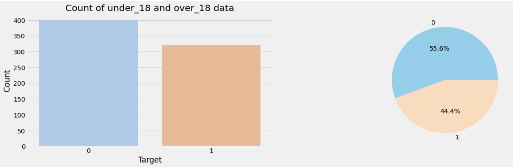
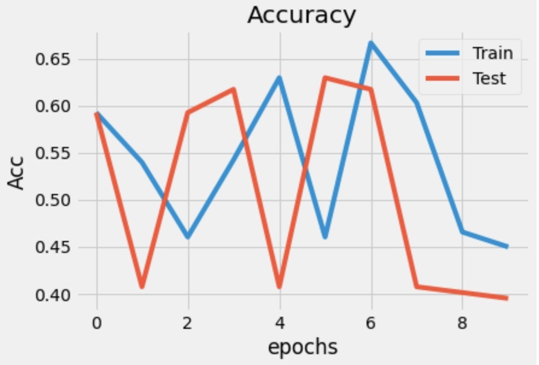
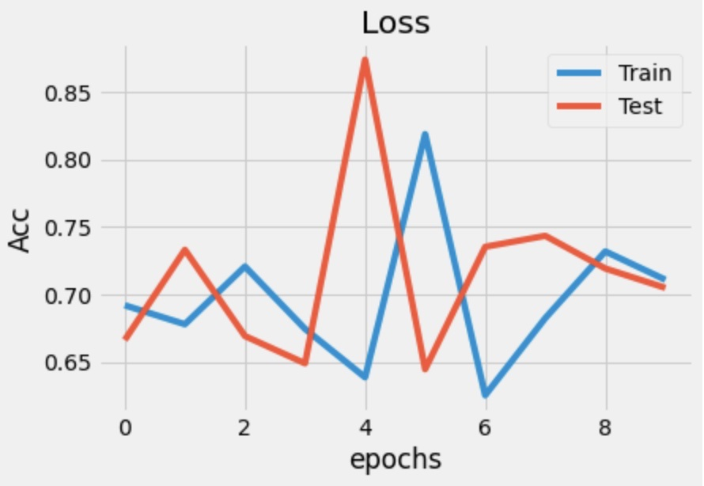

Eluvio DS Challenge
-----------------------------

As part of this challenge, we are given a dataset (likely of news articles)
that contains following fields:

Assuming the dataset is of title of News articles:

```
df.head(0)
time_created - time of creation	
date_created - date of creation	
up_votes     - number of up votes
down_votes   - number of down votes
title	     - title of the article
over_18	     - boolean that tells whether article is adult 
author	     - name of the article author
category     - category of the news article
```

---

### EDA

After some preliminary analysis, I find that the dataset is highly skewed towards `over_18=False`.



We also have only `category` that belongs to `worldnews`

Next I look at some of the authors plotting top5 grouped by `over_18`





Next I move onto cleaning the dataset, in particular the `title`

I wrote a helper `cleantext` class for the same which has various methods to clean the data. The `do_all` applies all
the cleansing methods in a particular order that I think will help me.

I also used the `dask` [package](https://docs.dask.org/en/latest/) to parallelize this operation.

Once I obtain the result of the cleaning I plot a word cloud for most frequently found words. It looks something like
this for titles filtered on `over_18=True`



Next I plot n-gram of words by writing a helper function `draw_n_grams`. The corresponding one-gram, two-gram and
three-gram plots look like these:

* one-gram
  

* two-gram
  

* three-gram
  

Based on above three n-grams analysis, I conclude the following --

* As we can see for one-gram word NFSW dominates for the over 18 category. Similarly ISIS, Syria, kill and shoot
  lemmanized words also dominate the one-gram

* For the two-gram words we can see NFSW joined with other words dominates the list

* As for the three-gram words we start to see a good pattern for the words that leads to classification of title as over
  18

### LSTM model training and predictions

Next I take mixed bag of titles (concat list of `over_18=True` and `over_18=False`)



I setup a `Sequential LSTM` model with following parameters

```
Model: "sequential_2"
_________________________________________________________________
Layer (type)                 Output Shape              Param #   
=================================================================
embedding_2 (Embedding)      (None, 300, 100)          1000000   
_________________________________________________________________
lstm_4 (LSTM)                (None, 300, 128)          117248    
_________________________________________________________________
lstm_5 (LSTM)                (None, 64)                49408     
_________________________________________________________________
dense_4 (Dense)              (None, 32)                2080      
_________________________________________________________________
dense_5 (Dense)              (None, 1)                 33        
=================================================================
Total params: 1,168,769
Trainable params: 168,769
Non-trainable params: 1,000,000
_________________________________________________________________
```

Upon training this model, I see the following accuracy and loss on the trained model

 



Following are the classification reports on the above trained model.

```
                 precision  recall  f1-score   support

         o18       1.00      1.00      1.00       100
         u18       1.00      1.00      1.00        80

    accuracy                           1.00       180
   macro avg       1.00      1.00      1.00       180
weighted avg       1.00      1.00      1.00       180

```
---
### Future scope

I believe using libraries like `dask` I've made my code resilient to run in distributed 
environment on larger volume of the dataset. I wish there were more input data on 
`over_18=True` so we could train our model on a broader range of words. 